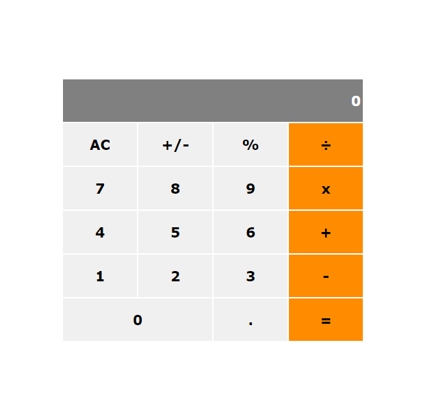

## Project Name

Math magician app

## Project Objectives

"Math magicians" is a website for all fans of mathematics. It is a Single Page App (SPA) that allows users to:

Make simple calculations.
Read a random math-relatewd quote.

## Built With

React

## Screenshot

## Live Demo
[Live demo here](https://stephen-math-magician.netlify.app/)

## Getting started
To get a local copy up and running follow these simple example steps:

## Author

👤 Ezea Stephen Nnabuike
- GitHub: [@stephnna](https://github.com/stephnna)
- Twitter: [@stephnna](https://twitter.com/stephnna)
- LinkedIn: [Linkedin](https://www.linkedin.com/in/stephen-nnabuike-ezea-143b97170/)

## Prerequisites
- Have a good knowledge on how to parse UI designs
- Have VSCode or other text editor installed. [Link to download VSCode](https://code.visualstudio.com/download)
- Install node package. [Link to download node](https://nodejs.org/en/download/)
- Have git installed.[Link to download git](https://git-scm.com/downloads)
- Create a github repository.

## Setup
- `https://github.com/stephnna/math-magicians`
- `cd math-magicians/`
- cd react-app
- npm start

## Run tests

For tracking linters errors locally, you need to follow these steps:
- For tracking linter errors in HTML file run:

1. `npm install --save-dev hint@6.x`
2. `npx hint .`

- For tracking linter errors in CSS file run:

1. `npm install --save-dev stylelint@13.x stylelint-scss@3.x stylelint-config-standard@21.x stylelint-csstree-validator@1.x`
2. `npx stylelint "**/*.{css,scss}"`

- For tracking linter errors in Javascript file run:

1. `npm install --save-dev eslint@7.x eslint-config-airbnb-base@14.x eslint-plugin-import@2.x babel-eslint@10.x`
2. `npx eslint .`

## 🤝 Contributing

Contributions, issues, and feature requests are welcome!
Feel free to check the [issues page](../../issues/).

## Show your support

Give a ⭐️ if you like this project!

## Acknowledgments

- Hat tip to anyone whose code and idea was used was used
- Inspiration
- etc

## 📝 License

This project is [MIT](./MIT.md) licensed.
